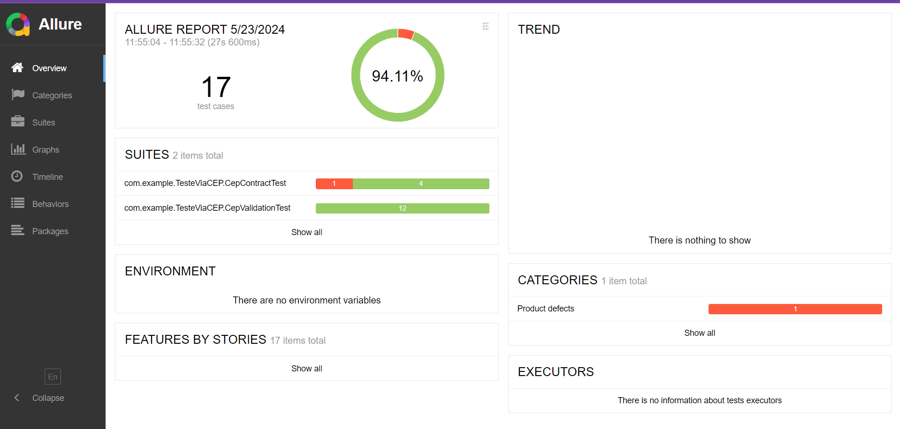

# TesteViaCep

## Descrição

Este projeto realiza testes automatizados utilizando RestAssured para validação de CEPs via o serviço ViaCEP.

## 1-Pré-requisitos 

- java 17

- Gradle 

- Git 


## 2-Clonar o Repositório

1. Clone o repositório:
    ```bash
    git clone https://github.com/Lucca08/TesteViaCEP.git
    cd TesteViaCEP
    ```

## 3-Dependências

- org.springframework.boot:spring-boot-starter-data-jpa
- org.hibernate.validator:hibernate-validator
- org.springframework.boot:spring-boot-starter-web
- org.projectlombok:lombok
- org.springframework.boot:spring-boot-devtools
- com.h2database:h2
- org.springframework.boot:spring-boot-starter-test
- io.rest-assured:rest-assured
- io.rest-assured:json-schema-validator
- org.springdoc:springdoc-openapi-starter-webmvc-ui


## 4-Cenários de teste

## Testes de Contrato 

1. CEP Válido
2. CEP Inválido 

## Testes 

3. CEP Vazio
4. CEP Valido
5. CEP Inválido
6. CEP Limite Mínimo e Maximo
7. CEP Válido com Formatação

## Detalhamento 

1. Teste de Contrato: CEP Válido

Descrição: Verificar se a API retorna um status
todos os campos necessarios para um retorno 200 (OK).

2. Teste de Contrato: CEP Inválido

Descrição: Verificar se a API retorna um status 400
(Bad Request) CEP inválido é fornecido e CEP não cadastrado.

3. CEP Vazio

Descrição: Verificar se a API retorna um status 400
(Bad Request) quando o CEP está vazio.

4. CEP Válido

Descrição: Verificar se a API retorna um status 200(OK) e o conteúdo esperado quando um CEP válido é fornecido.

5. CEP Inválido

Descrição: Verifica se a API retorna um status 400
(Bad Request) quando um CEP inválido é fornecido.

5. Teste de CEP com Limite Mínimo e Máximo de Caracteres

Descrição: Verifica se a API retorna um status 400
(Bad Request) quando um CEP com menos ou mais caracteres do que o permitido é fornecido.

6. Teste de CEP Válido com Formatação

Descrição: Verifica se a API retorna um status 200 (OK) quando um CEP válido é fornecido com formatação (máscara).

## Bugs encontrados


No cenário de teste de contrato para CEP inválido, 
foi identificado um bug. Ao utilizar o CEP
99999999, que está documentado no projeto como um 
exemplo de CEP inválido, a API retornou um status 
200 (OK). O comportamento esperado seria um status
400 (Bad Request), indicando que o CEP fornecido 
não é válido. Portanto, a resposta 200 é 
considerada um bug,pois a API não está tratando 
corretamente os CEPs inválidos conforme a 
documentação.

## 5-Rode os testes 


## 6-Gerar Relatorio de Teste

1. Gere o relatório Allure:
    ```bash
    allure serve allure-results
    ```

## Relatório gerado pelo Allure:

