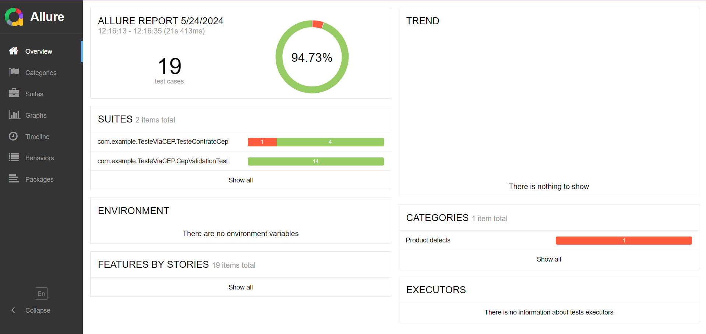

# TesteViaCep

## Descrição

Este projeto realiza testes automatizados utilizando RestAssured para validação de CEPs via o serviço ViaCEP.

## 1-Pré-requisitos 

- java 17

- Gradle 

- Git 


## 2-Clonar o Repositório

1. Clone o repositório:
    ```bash
    git clone https://github.com/Lucca08/TesteViaCEP.git
    cd TesteViaCEP
    ```

## 3-Dependências

- testImplementation 'io.rest-assured:rest-assured:5.3.2'
- implementation 'io.rest-assured:json-schema-validator:5.4.0'
- testImplementation 'org.junit.jupiter:junit-jupiter-api:5.11.0-M2'
- testImplementation 'org.junit.jupiter:junit-jupiter-params:5.8.1'
- testImplementation 'org.slf4j:slf4j-simple:1.7.36' 
- testImplementation 'org.junit.jupiter:junit-jupiter-engine:5.11.0-M2' 
- implementation 'net.datafaker:datafaker:2.2.2'

## 4-Cenários de teste

[CenariosDeTeste.md](CenariosDeTeste.md)

## 5-Bugs encontrados

No cenário de teste de contrato para CEP inválido, 
foi identificado um bug. Ao utilizar o CEP
99999999, que está documentado no projeto como um 
exemplo de CEP inválido, a API retornou um status 
200 (OK). O comportamento esperado seria um status
400 (Bad Request), indicando que o CEP fornecido 
não é válido. Portanto, a resposta 200 é 
considerada um bug,pois a API não está tratando 
corretamente os CEPs inválidos conforme a 
documentação.


## 6-Tabela de decisao

[Tabela De Decisao](TabelaDeDecisao.md)

## 7-Rode os testes 

1. Comando para rodar testes
    ```bash
    gradle test
    ```

## 8-Gerar Relatorio de Teste

1. Gere o relatório Allure:
    ```bash
    allure serve allure-results
    ```

## 9-Relatório gerado pelo Allure:

