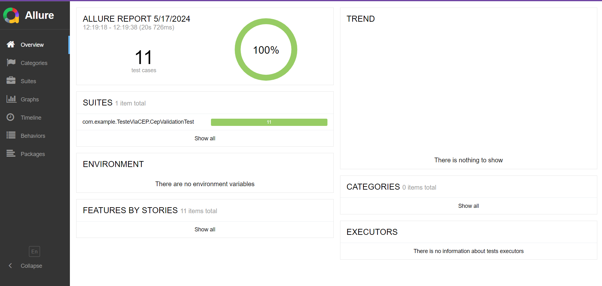

# TesteViaCep

## Descrição

Este projeto realiza testes automatizados utilizando RestAssured para validação de CEPs via o serviço ViaCEP.

## 1-Pré-requisitos 

- java 17

- Gradle 

- Git 


## 2-Clonar o Repositório

1. Clone o repositório:
    ```bash
    git clone https://github.com/Lucca08/TesteViaCEP.git
    cd TesteViaCEP
    ```

## 3-Dependências

- org.springframework.boot:spring-boot-starter-data-jpa
- org.hibernate.validator:hibernate-validator
- org.springframework.boot:spring-boot-starter-web
- org.projectlombok:lombok
- org.springframework.boot:spring-boot-devtools
- com.h2database:h2
- org.postgresql:postgresql
- org.springframework.boot:spring-boot-starter-test
- io.rest-assured:rest-assured
- io.rest-assured:json-schema-validator
- org.springdoc:springdoc-openapi-starter-webmvc-ui

## 4-Executar a Aplicação


1. Execute o projeto:
    ```bash
    ./gradlew test
    ```
## 4-Bugs Encontrados:
## Bug cep não encontrado: 
    No teste deveRetornar400QuandoCepNaoForInformado estava sendo retornado 400 mas deveria ser retornado 404, de acordo com a documentação do ViaCEP e de acordo com o padrão restfull, já que o retorno de um recurso inexistente é 404.
## Bug cep não cadastrado:
    No teste deveRetornar404QuandoCepNaoEstiverCadastrado estava sendo retornado 400 mas deveria ser retornado 404, de acordo com a documentação do ViaCEP, o retorno de um CEP inexistente é 404 e de acordo com o padrão restfULL, o retorno de um recurso inexistente é 404.


## 4-Gerar Relatorio de Teste

1. Gere o relatório Allure:
    ```bash
    allure serve allure-results
    ```

## Relatório gerado pelo Allure:

